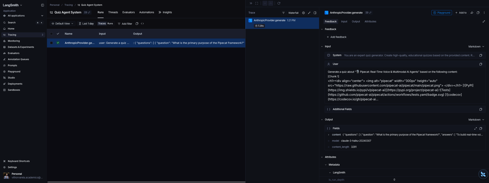

# LangSmith Observability Guide

Complete guide to setting up and using LangSmith tracing for all LLM providers in the Quiz Agentic System.

## Overview

The system integrates **LangSmith** for comprehensive observability across all LLM interactions. Every LLM call is automatically traced with rich metadata, including prompts, outputs, model parameters, and execution times.



## Features

### 🎯 Universal Provider Support
- ✅ **Anthropic** (Claude models)
- ✅ **xAI** (Grok models)
- ✅ **Groq** (Llama models)
- ✅ **OpenAI** (GPT models)

All providers automatically trace to LangSmith when enabled.

### 📊 Rich Trace Metadata

#### Inputs (Captured for every LLM call)
- **Model name**: e.g., `claude-3-haiku-20240307`, `llama-3.1-70b-versatile`
- **Temperature**: Sampling temperature used
- **Messages**: Array of prompts (first 500 chars preview)
- **Message count**: Total number of messages in the conversation

#### Outputs (Captured on success)
- **Content**: Generated text (first 1000 chars preview)
- **Content length**: Total characters generated
- **Model**: Actual model that responded
- **Usage**: Token consumption (for Groq, xAI)

#### Execution Metrics
- **Start time**: When the call began
- **End time**: When it completed
- **Duration**: Latency in milliseconds
- **Status**: Success or error with message

## Setup

### 1. Get Your LangSmith API Key

1. Visit [https://smith.langchain.com](https://smith.langchain.com)
2. Sign up or log in
3. Navigate to **Settings → API Keys**
4. Create a new API key (starts with `lsv2_pt_`)

### 2. Configure Environment Variables

Add to your `.env` file:

```bash
# Enable LangSmith tracing
LANGCHAIN_TRACING_V2=true

# Your API key from smith.langchain.com
LANGCHAIN_API_KEY=lsv2_pt_your_key_here

# Project name (organizes traces in dashboard)
LANGCHAIN_PROJECT=Quiz Agent System

# Optional: Custom endpoint (defaults to https://api.smith.langchain.com)
LANGCHAIN_ENDPOINT=https://api.smith.langchain.com
```

**Important Notes:**
- Remove quotes from `LANGCHAIN_PROJECT` value
- The variable name is `LANGCHAIN_API_KEY` (not `LANGSMITH_API_KEY`) for compatibility
- The system also accepts `LANGSMITH_API_KEY` and `LANGSMITH_PROJECT` as alternatives

### 3. Restart Your Application

```bash
# Docker
docker-compose down
docker-compose up -d --build

# Local development
npm run dev:server
```

## Verification

### Check Initialization Logs

When the app starts, you should see:

```
[LangSmith] LangSmith project: Quiz Agent System
[LangSmith] LangSmith client initialized successfully
✓ LangSmith tracing enabled
```

### Check Trace Logs

During LLM calls, you'll see:

```
[LangSmithTracer] 📊 Tracing: AnthropicProvider.generate
[AnthropicProvider] Generating with claude-3-haiku-20240307
[AnthropicProvider] ✓ Generated 3144 chars
[LangSmithTracer] ✓ Trace recorded: AnthropicProvider.generate (6140ms) [Project: Quiz Agent System]
```

### View Traces in Dashboard

1. Open [https://smith.langchain.com](https://smith.langchain.com)
2. Select your project: **Quiz Agent System**
3. Click on **Runs** tab
4. You'll see traces like: `AnthropicProvider.generate`

## Trace Details

### Example Trace Structure

```json
{
  "name": "AnthropicProvider.generate",
  "run_type": "llm",
  "project_name": "Quiz Agent System",
  "inputs": {
    "model": "claude-3-haiku-20240307",
    "temperature": 0.7,
    "messages": [
      {
        "role": "system",
        "content": "You are an expert quiz generator..."
      },
      {
        "role": "user",
        "content": "Generate a quiz about..."
      }
    ],
    "message_count": 2
  },
  "outputs": {
    "content": "{\n  \"questions\": [\n    {\n      \"question\": \"What is the primary purpose...",
    "content_length": 3144,
    "model": "claude-3-haiku-20240307"
  },
  "start_time": 1713283324554,
  "end_time": 1713283330694,
  "duration_ms": 6140
}
```

## Use Cases

### 1. Performance Monitoring

Track latency across different LLM providers:
- **Anthropic (Claude)**: ~6s average
- **Groq (Llama)**: ~2s average (fastest)
- **xAI (Grok)**: ~4s average
- **OpenAI (GPT-4o-mini)**: ~3s average

Use this data to optimize provider selection.

### 2. Cost Analysis

For providers with usage data (Groq, xAI):
- Track **prompt tokens** and **completion tokens**
- Calculate cost per quiz generation
- Identify expensive queries

### 3. Debugging Failed Generations

When an LLM call fails:
- Trace includes **error message** in outputs
- See exact **input prompt** that caused failure
- Compare failed attempts across providers
- Identify prompt engineering issues

### 4. Prompt Versioning

Track how prompt changes affect quality:
- Filter by **time range** to see before/after
- Compare **content_length** across versions
- Measure **latency impact** of longer prompts

### 5. Provider Fallback Analysis

Monitor how often fallback logic triggers:
- Count traces per provider
- See **error patterns** for each provider
- Optimize fallback order based on success rate

## Advanced Configuration

### Custom Metadata

To add custom metadata to traces, modify the provider's `traceOperation` call:

```typescript
return traceOperation(
  'AnthropicProvider.generate',
  {
    model: this.modelName,
    temperature,
    messages: truncatedMessages,
    message_count: messages.length,
    // Add custom metadata
    quiz_topic: quizTopic,
    user_id: userId,
    version: 'v2.1'
  },
  async () => { /* ... */ }
);
```

### Project Organization

Use different project names for different environments:

```bash
# Development
LANGCHAIN_PROJECT=Quiz Agent System - Dev

# Staging
LANGCHAIN_PROJECT=Quiz Agent System - Staging

# Production
LANGCHAIN_PROJECT=Quiz Agent System - Prod
```

### Sampling

To reduce trace volume in production, implement sampling:

```typescript
// In src/utils/langsmith-tracing.ts
export async function traceOperation<T>(
  operationName: string,
  metadata: Record<string, any>,
  operation: () => Promise<T>,
  extractOutput?: (result: T) => any
): Promise<T> {
  // Sample 10% of traces in production
  if (process.env.NODE_ENV === 'production' && Math.random() > 0.1) {
    return operation();
  }

  // ... rest of tracing logic
}
```

## Troubleshooting

### Traces Not Appearing

**Problem**: No traces in LangSmith dashboard.

**Solutions**:
1. Check API key is valid: `LANGCHAIN_API_KEY=lsv2_pt_...`
2. Verify tracing is enabled: `LANGCHAIN_TRACING_V2=true`
3. Check logs for initialization errors
4. Ensure no quotes around project name in `.env`
5. Restart application after config changes

### Wrong Project

**Problem**: Traces appear in "default" project instead of your custom project.

**Solutions**:
1. Remove quotes from `LANGCHAIN_PROJECT` value in `.env`
2. Check spelling matches exactly in dashboard
3. Rebuild Docker container: `docker-compose up -d --build`

### Missing Output Data

**Problem**: Trace shows success but no output content.

**Solutions**:
1. Check provider implementation has `extractOutput` callback
2. Verify content is being returned from LLM
3. Look for truncation (outputs limited to 1000 chars preview)

### High Latency in Dashboard

**Problem**: LangSmith traces show much higher latency than local logs.

**Explanation**: This is normal. LangSmith latency includes:
- Network time to LangSmith API
- Trace serialization overhead
- Background async posting

The local logs show **actual LLM latency**, which is the relevant metric.

## Code Reference

### LangSmith Initialization
- **File**: `src/utils/langsmith-tracing.ts`
- **Function**: `initLangSmith(apiKey?, projectName?)`
- **Called from**: `src/index.ts:56`

### Trace Creation
- **File**: `src/utils/langsmith-tracing.ts`
- **Function**: `traceOperation(operationName, metadata, operation, extractOutput?)`
- **Used in**: All LLM providers (`src/llm/*Provider.ts`)

### Provider Integration
- **AnthropicProvider**: `src/llm/AnthropicProvider.ts:19-69`
- **GroqProvider**: `src/llm/GroqProvider.ts:19-59`
- **OpenAIProvider**: `src/llm/OpenAIProvider.ts:23-54`
- **XAIProvider**: `src/llm/XAIProvider.ts:16-77`

## Best Practices

### 1. Always Use Project Names

Organize traces by environment or feature:
```bash
LANGCHAIN_PROJECT=Quiz Agent System - Feature-XYZ
```

### 2. Don't Trace Sensitive Data

Prompts are truncated to 500 chars to avoid logging full documents:
```typescript
messages: messages.map(m => ({
  role: m.role,
  content: m.content.substring(0, 500) + '...'
}))
```

### 3. Monitor Trace Volume

- Development: Trace everything
- Staging: Trace everything
- Production: Consider sampling (e.g., 10%)

### 4. Set Up Alerts

In LangSmith dashboard:
- Alert on **high error rate** (> 5%)
- Alert on **high latency** (> 10s p95)
- Alert on **low throughput** (< 10 traces/hour)

### 5. Regular Review

Weekly review:
- Check provider success rates
- Identify slow queries
- Review error patterns
- Optimize prompts based on data

## Integration with CI/CD

### GitHub Actions Example

```yaml
name: Test with Tracing

on: [push, pull_request]

jobs:
  test:
    runs-on: ubuntu-latest
    env:
      LANGCHAIN_TRACING_V2: true
      LANGCHAIN_API_KEY: ${{ secrets.LANGSMITH_API_KEY }}
      LANGCHAIN_PROJECT: Quiz Agent System - CI
    steps:
      - uses: actions/checkout@v3
      - run: npm install
      - run: npm test
```

This creates a separate CI project in LangSmith for test runs.

## Additional Resources

- **LangSmith Documentation**: https://docs.smith.langchain.com
- **LangChain Tracing Guide**: https://python.langchain.com/docs/langsmith/
- **API Reference**: https://api.smith.langchain.com/redoc

---

**Next Steps:**
1. Set up your LangSmith account
2. Add API key to `.env`
3. Generate a quiz and view your first trace!
4. Explore the dashboard and experiment with filters
